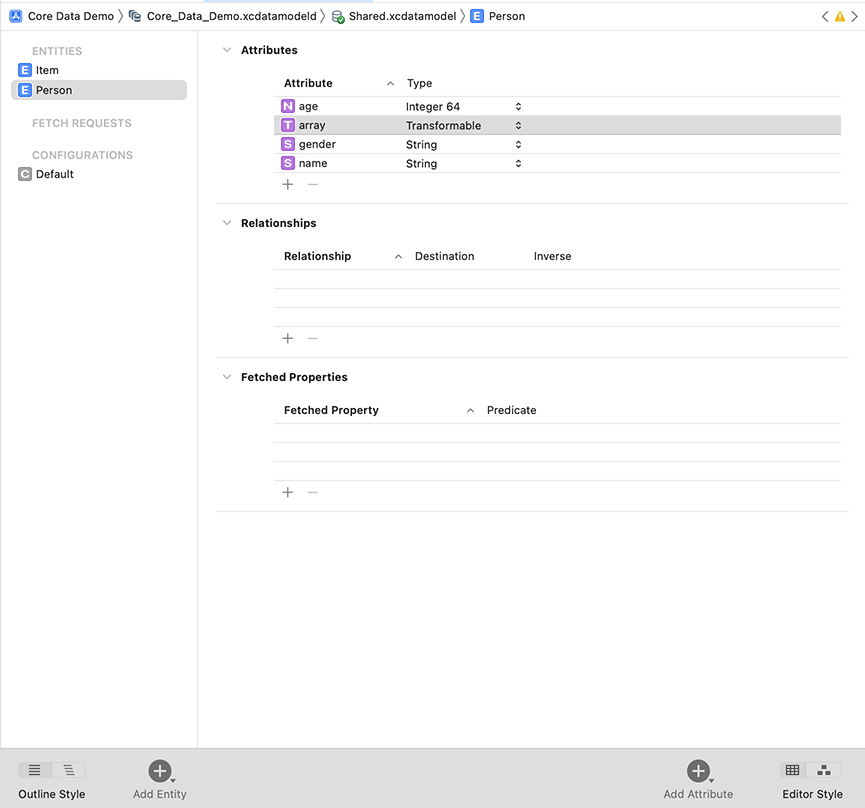
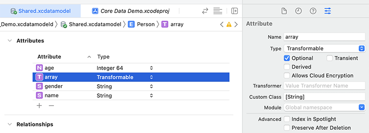
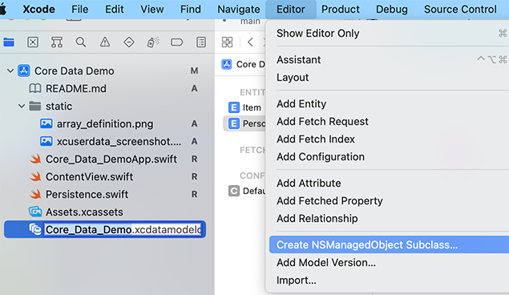
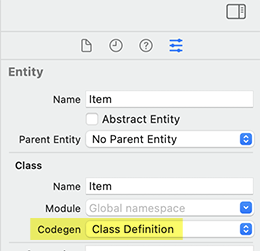
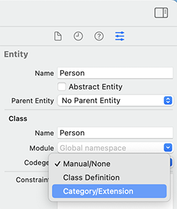
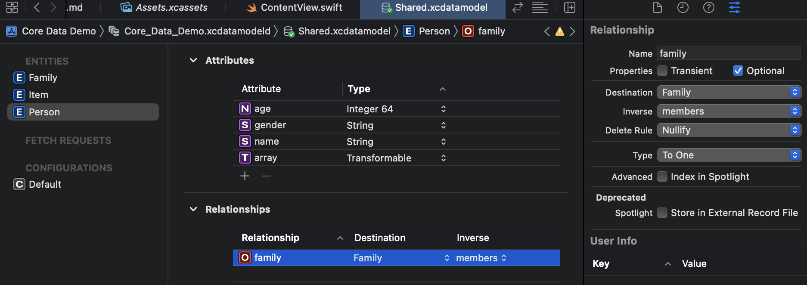

#  Save Data Locally in iOS Apps
This repo explains how to store data in your iOS app for persistent use, e.g.
the user closes the app, but not all of the data is lost (as normally happens).
The information comes from the excellent iOS Databases Module 5 course by https://codewithchris.com. Highly recommend CWC+!

# Table of contents

- [Save Data Locally in iOS Apps](#save-data-locally-in-ios-apps)
- [Table of contents](#table-of-contents)
  - [How to Store Data Locally in an iOS app](#how-to-store-data-locally-in-an-ios-app)
- [Core Data Model](#core-data-model)
  - [Defining Entities](#defining-entities)
- [Persistence Container](#persistence-container)
- [Managed Object Context](#managed-object-context)
- [CRUD Operations](#crud-operations)
  - [Creating Data](#creating-data)
  - [Reading Data](#reading-data)
  - [Update Data](#update-data)
  - [Delete Data](#delete-data)
  - [Preview Data](#preview-data)
- [Sorting Data](#sorting-data)
  - [Predicates](#predicates)
  - [Sort + Predicate Search](#sort--predicate-search)

## How to Store Data Locally in an iOS app
These are the main steps to generate our CoreData:
1) Define Entities and their attributes in the Core Data model.
1) Generate classes from the Core Data model.
1) Reference the Persistence Container
1) Use `Managed Object Context` to save/ delete/ update Core Data.

# Core Data Model
In the Core Data model, the `.xcdatamodel` file, we define our `Entities` as well as attributes of those entities.
These entities represent our classes and their properties.

## Defining Entities
XCode auto-generates a demo Item `Entity` to use within our project. We click that same
`.xcdatamodel` file to add/ customize any other entities that we want to remain persistent
after closing the app.

### Manual Code Generation 
For this example, we use the codegen option on the right for manual code
gen. Here you define your attributes (property equivalents) for each of
the entitites. 
 
For an array type, we use the `transformable` type. Then, expand the right-hand side.
From here, in the custom class field you input that it is an array of a type of your choosing. 
In this example, we define an attribute as a String array. 


Once you defined your Entity, you must create an `NSManaged Object Subclass` based on it. 


This creates two new files. The first can be thought of as the normal Class in Swift.
The second is an extension of that class. You can modify the first. 
However, whenever you create new attributes/ change their types, it is best
to do this `.xcdatamodel` file, then re-generate another `NSManaged Object Subclass`
in order to use Core Data. 


### Auto-Code Generation (Default) 
However, by default entities use the `Class Definition` codegen. This 
allows Xcode to manage the entities/ their changes behind the scenes. In
this way, we do not have to manually generate a new `NSManaged Object Subclass`, because
Xcode takes care of this for us behind the scenes. This explains why
we do not see equivalent class files/ extensions for the auto-generated
`Item` entity.


### Category Extension
Unlike, with our `Person` entity, where we can add custom methods to it, 
the `Item` entity does not allow us to do this.
We can gain back more control by switching the `codegen` option to the third one available.


This allows Xcode to manage the Extension file automatically in the background for us. 
While we can still control the class's methods in a normal manner. 

# Persistence Container
This is the third piece to the puzzle to use Core Data. You will find in 
your Xcode project a `Persistence` struct, which represents this container.
We use this struct to interact between the app and the Core Data SQLite databse.
Reference the persistence container in the following manner:
```
// Create instance of the PersistenceController
let a = PersistenceController()

// Reference the persistence container
a.container
```

Or better yet, the `Persistence` struct already includes an instance of the container.
This prevents us from needing to reload everything from the container, because
upon initialization it was already loaded for us. We can acces it in the
following way:
```
let container = PersistenceController.shared
```

Rather, we can make this container into a `singleton` by making the `init`
method in the `Persistence` struct private. This prevents the creation
of any other `Peristence` objects. Instead, you must use the `shared`
public attribute in order to use the container.
```
let container: NSPersistentContainer

private init(inMemory: Bool = false) {
```

# Managed Object Context
The Managed Object Context allows us to perform Create, Read, Update, Delete (CRUD)
operations in the Core Data datastore.  

XCode makes it easy to access the `Managed Object Context` by passing it
into the app from the root of the project as an `environment` value. This
Environment value is similar to the `EnvironmentObject` normally used to 
track the `ContentModel` within the app. It allows you to access the value
in any of the sub-views of the ContentView.
This code is generated automatically for you, when you select Core Data.
```
let persistenceController = PersistenceController.shared

var body: some Scene {
    WindowGroup {
        ContentView()
            .environment(\.managedObjectContext, persistenceController.container.viewContext)
    }
```

In the `ContentView`, we access the passed-in `Managed Object Context` by using the same 
path as defined above in the `Core_Data_DemoApp` view.
```
@Environment(\.managedObjectContext) private var viewContext
```

# CRUD Operations
## Creating Data
```
// Initializing the person, we can also pass in the NSManaged Object Context
// This specifies that we want to store this object in Core Data
let p = Person(context: viewContext)
p.age = 20
p.name = "Tom"

// Save to the data store
do {
    try viewContext.save()
}
catch {
    // Catch any errors
```

## Reading Data
Behind the scenes, if you selected the `codegen` options of `Class Definition` 
or `Category/Extension`, Xcode generates code for us to retrieve all of 
the `Entity` objects from the data store. To see this code, you can
change one of the codegen types for one of your entities to `Manual`. 
Then, while keeping that entity selected go to `Editor -> Create NSManaged Object Subclass`.
You can see in here a method name `fetchRequest` that will get all of the entities
with the `Person` type from the data store.
```
extension Person {

    @nonobjc public class func fetchRequest() -> NSFetchRequest<Person> {
        return NSFetchRequest<Person>(entityName: "Person")
    }

    @NSManaged public var name: String?
    @NSManaged public var gender: String?
    @NSManaged public var age: Int64
    @NSManaged public var array: [String]?

}

extension Person : Identifiable {

}
```
You can easily get all of the `Person` objects in the data store with the following code:
```
// Used to fetch all of our people in the data store
@FetchRequest(sortDescriptors: []) var people: FetchedResults<Person>
```

One of the greatest benefits of using the wrapper (the `@FetchRequest`) is that it immediately loads the data from the
database/ as soon as the View loads. It will also keep this data up to date as changes occur.

## Update Data
You can simply change the object in question, then use the `viewContext.save()` to savw it.

## Delete Data
In order to delete data, you can pass in the object, similar to appending the object to an array. However,
in order to lock-in the changes, you must then call the `.saveData()` method.
```
viewContext.delete(person)
try! viewContext.save()
```

## Preview Data
In order to Preview Core Data, you need to make sure the `preview` attribute within the Persistence struct
is setup.
```
static var preview: PersistenceController = {
    // Uses inMemory flag, so the objects are not truly added to the data store
    let result = PersistenceController(inMemory: true)
    let viewContext = result.container.viewContext
    for _ in 0..<10 {
        // Create dummy persons
        let newItem = Person(context: viewContext)
        // Set name to Sam
        newItem.name = "Sam"
    }
    do {
        // Saves into temp file
        try viewContext.save()
    } catch {
        // Replace this implementation with code to handle the error appropriately.
        // fatalError() causes the application to generate a crash log and terminate. You should not use this function in a shipping application, although it may be useful during development.
        let nsError = error as NSError
        fatalError("Unresolved error \(nsError), \(nsError.userInfo)")
    }
    return result
}()
```

# Sorting Data
We use a `sort descriptor` in order to sort data as we retrieve it from the database. You can use the 
following `sort descriptor` to get the people from the database sorted by the youngest person first:
```
@FetchRequest(sortDescriptors: [NSSortDescriptor(key: "age", ascending: true)]) var people: FetchedResults<Person>
```

If you wanted the oldest person first, then you would change, `ascending` above to false.

You can also pass in multiple sort descriptors. You would likely want this type of sort mechanism in case
you had two people with the same last name. In that case, you would want to then sort based on the person's first
name as well. 

Here the code uses two sort descriptors to sort the data:
```
@FetchRequest(sortDescriptors: [
    NSSortDescriptor(key: "name", ascending: true), // Sort by name first
    NSSortDescriptor(key: "age", ascending: true)  // Then sort by age
]) var people: FetchedResults<Person>
```

## Predicates
If you want a more detailed query, then you can use a predicate. For example, in order to filter 
by a certain name, we would use the following predicate: `NSPredicate(format: "name contains 'Joe'")`. 
Combined it looks like this:
```
// Used to fetch all of our people in the data store
@FetchRequest(sortDescriptors: [
    NSSortDescriptor(key: "name", ascending: true), // Sort by name first
    NSSortDescriptor(key: "age", ascending: true)  // Then sort by age
], predicate: NSPredicate(format: "name contains 'Joe'"))
var people: FetchedResults<Person>
```

See [Apple's documentation](https://developer.apple.com/documentation/foundation/nspredicate) for 
more predicate syntax examples.

## Sort + Predicate Search
We can use a `TextField` with a binding value in order to filter data for whatever the user types.
In this case, we manually create a fetch request. Then, we add the the `sortDescriptors` and the `predicate`
one at a time. We also access the built-in `fetchRequest` method that is automatically generated by 
the code for the entity in the background with the codegen `Category/Extension` mode.
```
/*
 Fetches all of the Persons in the Core Data model based on the user's
 filter in the filterByText property
 */
func fetchData() {
    // Create fetch request
    let request = Person.fetchRequest()
    
    // Set sort descriptors and predicates
    request.sortDescriptors = [NSSortDescriptor(key: "age", ascending: true)]
    
    // The percent at signs will be replaced by our filterByText value
    request.predicate = NSPredicate(format: "name contains %@", filterByText)
    
    // Execute the query in the main thread, because it changes the UI
    DispatchQueue.main.async {
        do {
            // Tries to execute the request
             let results = try viewContext.fetch(request)
            
            // Returns list of people and assigns them to the Person array
            self.people = results
            
        } catch {
            // Print any errors
            print(error.localizedDescription)
        }
    }
    
}
```

Then, for the `TextField` that takes the user's name, we can use the `onEditingChanged` argument. 
This detects if the user started typing, or stopped typing by clicking elsewhere, or pressing enter to
search for the name.
```
TextField("Filter Text", text: $filterByText, onEditingChanged: { _ in
    // Every change to the data it fetches the list
    fetchData()
})
```

However, in order to make a good user experience, one in which results change for every character typed,
we would prefer to fetch the data for every change to this list.
We can achieve this through an `onChange` modifier of the `VStack` that displays the data.
```
//         Whenever the filterByText value changes, it will retrieve the data from the database
.onChange(of: filterByText) { newValue in
    // Fetches core data
    fetchData()
}
``` 

# Relationships 
You can add relationships between entitites, and make them one to one as the default
stands, or make it one to many under the `.xcdatamodel` file.


Likewise, you must then setup a one to many relationship frome the Person 
entity with the family entity in order to maintain the consistency in 
the Core Data deserializations.


In the code, you can access the various properties that represent these relationships. So to make a particular person
belong to a particular family, we can do it in the following way:
```
// Create new Family object within the NSManaged Object context
let f = Family(context: viewContext)
// Set the name
f.name = "Robinsons Family"

// Create a person in the same context
let p = Person(context: viewContext)

// Associate this person with this family
p.family = f

// Save this information
try! viewContext.save()
```

By the same token, we could use a method from the Family side to add this person to this family: 
```
// Add person from the family side
f.addToMembers(p)
```

The `addToMembers` method was automatically generated, and you can view this extension/ its details by selecting the 
Manual codegen, then saving the files. You may have to save both the Person and Family files, then move them to the 
Models folder.

The code for the Family/ its methods are as follows:
```
extension Family {

    @nonobjc public class func fetchRequest() -> NSFetchRequest<Family> {
        return NSFetchRequest<Family>(entityName: "Family")
    }

    @NSManaged public var name: String?
    @NSManaged public var members: NSSet?

}

// MARK: Generated accessors for members
extension Family {

    @objc(addMembersObject:)
    @NSManaged public func addToMembers(_ value: Person)

    @objc(removeMembersObject:)
    @NSManaged public func removeFromMembers(_ value: Person)

    @objc(addMembers:)
    @NSManaged public func addToMembers(_ values: NSSet)

    @objc(removeMembers:)
    @NSManaged public func removeFromMembers(_ values: NSSet)

}
```


